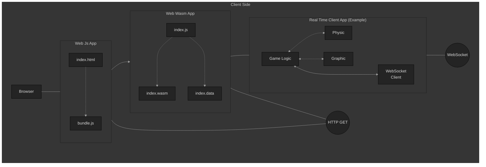
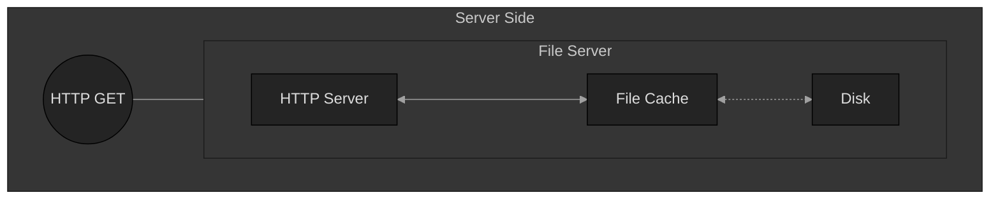
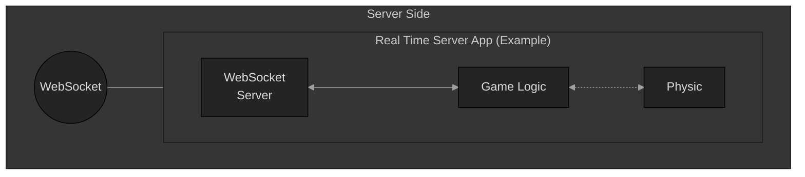
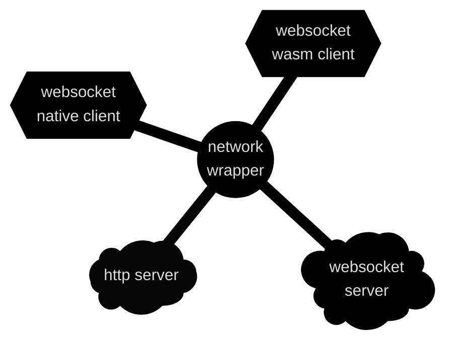

# All C++ WebSocket Client Server

## Table of Contents
- [All C++ WebSocket Client Server](#all-c-websocket-client-server)
  - [Table of Contents](#table-of-contents)
- [Description](#description)
  - [The Client Side:](#the-client-side)
  - [The Server Side:](#the-server-side)
    - [Http Server:](#http-server)
    - [WebSocket Server:](#websocket-server)
  - [The Network Wrapper:](#the-network-wrapper)
- [Dependencies](#dependencies)
  - [Client-Side:](#client-side)
  - [Server-Side: zlib, boost](#server-side-zlib-boost)
- [How to Build](#how-to-build)
  - [Build Everything (client + server side, also run the server)](#build-everything-client--server-side-also-run-the-server)
- [How to Run](#how-to-run)
  - [Step 1 - Run The Server](#step-1---run-the-server)
  - [Step 2 - Load The Client](#step-2---load-the-client)
- [Thanks for watching!](#thanks-for-watching)

# Description

C++ Client-Server example

## The Client Side:
* is written in C++ and compiled to WebAssembly
  * which offer the (currently) highest performance possible within a browser
    * 1.7x slower than native speed
    * or ~5-6 times faster than JavaScript (also devoid of GC slowdown)
* will connect to the server with a websocket inside the WebAssembly logic
  * the connection is established using a config fetched from the server-side (easily configured if needed)
* a native version of the client is also available
  * mostly for development and debug purpose:
    * tools like gdb and valgrind become available
  * the code is written in a way were the only the network-wrapper websocket need to change
    * TBD: concrete example with libcryptopp?
    * TBD: concrete example with libSDL2?
* most of the websocket code is located in the network-wrapper
  * abstracted and interchangeable between native/wasm builds
  * the native part rely on boost which is slow to compile
    * the network-wrapper is compiled once, eliminating this issue



## The Server Side:
* is written in C++ and compiled to a native binary
* the network (Http and WebSockets) use boost Asio beast
  * rely on boost executor(s)
    * which in turn, rely on boost strand
      * [which is a more efficient way to use multi-threading](https://www.crazygaze.com/blog/2016/03/17/how-strands-work-and-why-you-should-use-them/)
  * the number of thread(s) used can be configured
* most of the http and websocket code is located in the network-wrapper
  * this rely on boost which is slow to compile
    * the network-wrapper is compiled once, eliminating this issue

### Http Server:
* recursively explore an asset folder
  * open every files (when possible)
  * compress the opened files (when possible)
  * cache in-memory (hash map)
    * compressed files must be smaller to be kept in the cache
* accept and reply to HTTP request (GET)
  * handle any custom requests
    * used to reply the "web-socket-config.json"
  * retrieve the requested file from the cache
    * reply the requested file
      * if available and supported, will reply the compressed payload
    * will set the appropriate content-type header (when supported)
  * 404 status if the requested file is missing from the in-memory cache




### WebSocket Server:
* event(s)
  * accept connection(s)
    * register the new user
    * broadcast "new user" to all users
  * new message(s)
    * read messages
    * broadcast "new message" to all users
  * disconnection
    * remove the lost user
    * broadcast "disconnected user" to all users
* a thread safe session manager is included
  * a `shared mutex` is used
    * multiple read will rely on `shared lock(s)`
    * unique write will rely on `unique lock(s)`




## The Network Wrapper:
* is written in C++ and compiled to a native archive or a wasm bytecode
  * the native part contains
    * an abstracted http server
    * an abstracted websocket server
    * an abstracted websocket client
  * the wasm part contains
    * an abstracted websocket client
* the native parts rely on boost Asio beast
  * rely on boost executor(s)
    * which in turn, rely on boost strand
      * [which is a more efficient way to use multi-threading](https://www.crazygaze.com/blog/2016/03/17/how-strands-work-and-why-you-should-use-them/)
* abstracting it away in that kind of wrapper
  * make boost slow compilation happens only once
  * allow the client-side to work in native and wasm with nearly the same code





# Dependencies

## Client-Side:

- Emscripten 3.1.44
  - This will be locally installed (cloned and setup) if not detected
  - the 3.1.44 version will be ensured, even if already present
- NodeJs

## Server-Side: zlib, boost

- g++ (build-essential)
- libzstd1
- libboost1.71-dev

# How to Build

## Build Everything (client + server side, also run the server)

```bash
chmod +x ./sh_build_everything.sh
./sh_build_everything.sh
# will:
# -> build the client C++ application (wasm)
# -> build the client TypeScript wasm-loader (JavaScript)
# -> build the server C++ application (binary)
# -> copy the client files in the server asset folder
# -> run the server
#    -> http-port: 777
#    -> ws-port: 8888
#    -> threads all at 1
```

# How to Run

## Step 1 - Run The Server

```bash
# the server need to be started from the "./server-side" folder
# -> mainly since this is where the "files/" folder is located
cd ./server-side

#           ip-address  http-port  ws-port  http-threads  ws-threads
./bin/exec  127.0.0.1   7777       8888     1             1
```

## Step 2 - Load The Client

```bash
# http://{ip-address}:{http-port}/
http://127.0.0.1:7777/

# to see it in action -> open more tabs with the same url
# -> will log broadcasts of when a new clients join/leave
```

# Thanks for watching!
